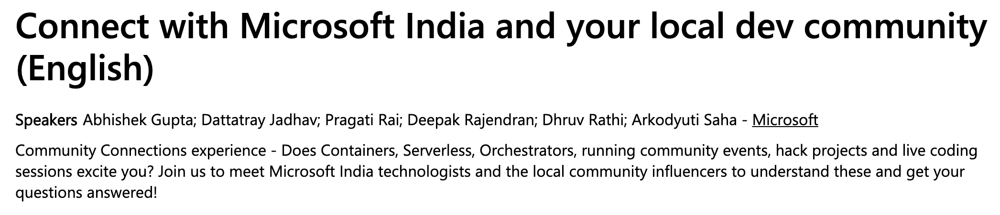

# //Build2020: Connect with Microsoft India and your local dev community

Session info: https://mybuild.microsoft.com/sessions/3a2d054f-ba4e-4e85-a9ac-dfa81b1032b6?source=sessions

## Slides

TODO

## Resources

### Azure

- Build Serverless apps with Azure Functions using Java: https://cda.ms/1hs
- Developer Guide for Azure Event Hubs with Kafka: https://cda.ms/1hx
- Integrate Azure Cosmos DB with Azure Functions: https://cda.ms/1hv
- How to detect sentiment using the Text Analytics API: https://cda.ms/1hw

### You may also like ;)

- Real-time Serverless Processing: https://aka.ms/az-serverless-processing
- Build a Serverless Slack backend: https://aka.ms/serverless-slack-app
- Use Azure Cognitive Services to build a Translator app: https://aka.ms/azure-translator-app